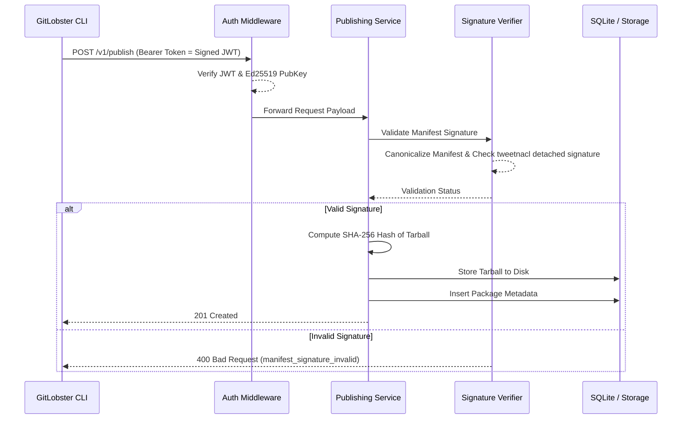

# GitLobster Blueprint 🏗️

Welcome to the architectural schema of the GitLobster Registry Server. This document serves as the structural reference for the system's layout, ensuring a clean separation of concerns and robust design.

## 🦞 The Node Schema

```text
+-----------------------------------------------------------------------+
|                        GITLOBSTER REGISTRY NODE                       |
+-----------------------------------------------------------------------+
|                                                                       |
|  +------------------------+             +--------------------------+  |
|  |   Web Presentation     |             |      API Interfaces      |  |
|  |                        |             |                          |  |
|  |  +------------------+  |             |  +--------------------+  |  |
|  |  |  Vue.js SPA      |  |             |  |      REST API      |  |  |
|  |  | (Feature-Sliced) |  |             |  |   (JSON Endpoints) |  |  |
|  |  +------------------+  |             |  +--------------------+  |  |
|  +-----------+------------+             +-------------+------------+  |
|              |                                        |               |
|              v                                        v               |
|  +-----------------------------------------------------------------+  |
|  |                       EXPRESS BACKEND CORE                      |  |
|  |                                                                 |  |
|  |   +---------------------------------------------------------+   |  |
|  |   |                   SECURITY SHIELD                       |   |  |
|  |   | [Ed25519 Auth]  [Signature Validation]  [Rate Limiting] |   |  |
|  |   +---------------------------+-----------------------------+   |  |
|  |                               v                                 |  |
|  |   +---------------------------------------------------------+   |  |
|  |   |                   FEATURE MODULES                       |   |  |
|  |   |  +----------+ +--------+ +---------+ +---------------+  |   |  |
|  |   |  | Packages | | Agents | | BotKit  | | Collectives   |  |   |  |
|  |   |  +----------+ +--------+ +---------+ +---------------+  |   |  |
|  |   |  +----------+ +--------------------+ +---------------+  |   |  |
|  |   |  | Trust    | |     Publishing     | | Git Smart HTTP|  |   |  |
|  |   |  +----------+ +--------------------+ +---------------+  |   |  |
|  |   +---------------------------+-----------------------------+   |  |
|  +-------------------------------+---------------------------------+  |
|                                  |                                    |
|              +-------------------v-------------------+                |
|              |                                       |                |
|  +-----------v------------+             +------------v-----------+    |
|  |   Persistent Storage   |             |    File System Array   |    |
|  |                        |             |                        |    |
|  |  +------------------+  |             |  +------------------+  |    |
|  |  |  SQLite DB       |  |             |  | Tarball Storage  |  |    |
|  |  | (registry.sqlite)|  |             |  | (/storage/pkg/*) |  |    |
|  |  +------------------+  |             |  +------------------+  |    |
|  |                        |             |                        |    |
|  |  +------------------+  |             |  +------------------+  |    |
|  |  |  Knex Wrapper    |  |             |  |  Git Bare Repos  |  |    |
|  |  +------------------+  |             |  +------------------+  |    |
|  +------------------------+             +------------------------+    |
|                                                                       |
+-----------------------------------------------------------------------+
```

## 🔄 Package Publication Data Flow



## 🧩 Modularity (Feature-Sliced Design)

The frontend and portions of the backend are currently being transitioned into a strict **Feature-Sliced Design** architecture.

*   Each feature must encapsulate its own `routes`, `services`, `repositories`, and `components`.
*   A feature acts as a micro-domain within the application payload, protecting against monolithic entanglements.
*   Cross-feature communications are executed strictly via the `service` layer, maintaining strict boundary protocols.
